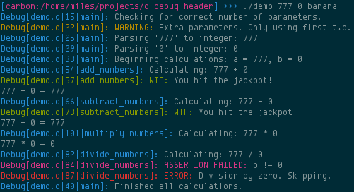

## About

The [`debug.h`](debug.h) header file can be included into a C source file to enable
several different debugging macros. Support for all versions of C greater than
or equal to C89 is provided with slightly different syntax.

## Usage

There are five different macros included in the header:

* `debug()` is used for general purpose debugging statements.
* `debug_w()` is used for warning messages.
* `debug_e()` is used for error messages.
* `debug_wtf()` is used for things that should never ever happen. (What a Terrible Failure!)
* `assert()` is used to check the truth of some boolean expression.

All of the debug statements support printf-style format strings (excluding `assert()`).
Additionally, a newline is automatically written after each message, so you
don't need to add `\n` to the end of your debug statements.

### C89 / ANSI C

Add the `-DDEBUG89` flag to your compilation command to enable the
C89-compatible debug statements.

```
gcc -ansi -DDEBUG89 demo89.c -o demo89
```

Due to the lack of `__VA_ARGS__` in C89, the macro calls must be
wrapped in two sets of parentheses to cope with a variable number of
parameters. The exception to this rule is the `assert()` macro, which only
uses a single set of parentheses.

```c
/* Two sets of parentheses. */
debug(("A debug message!"));
debug_w(("Parameter x has a negative value: %d", x));

/* Single set of parentheses. */
assert(x != 3);
```

See [`demo89.c`](demo89.c) for example usage.

### C99 or Later

Add the `-DDEBUG` flag to your compilation command to enable the regular
debug statements.

```
gcc -DDEBUG demo.c -o demo
```

All of the macros use only a single set of parenthesis using this option.

```c
/* Single set of parentheses. */
debug("A debug message!");
debug_w("Parameter x has negative value: %d", x);

/* Single set of parentheses. */
assert(x != 3);
```

See [`demo.c`](demo.c) for example usage.

### ANSI Colors

ANSI color escape sequences can be enabled to make the output of the debugging
statements more visible. Simply add the `-DDEBUG_COLOR` flag to your
compilation command along with either `-DDEBUG` or `-DDEBUG89`. This option will only
work correctly if your terminal supports ANSI escape sequences (i.e. not `cmd.exe`
on Windows).

```
gcc -DDEBUG -DDEBUG_COLOR program.c -o program
```

## Example Output

Here's an example of colorized output from the demo program.



## (Un)license

This project is released into the public domain under the terms of
[The Unlicense](UNLICENSE).
